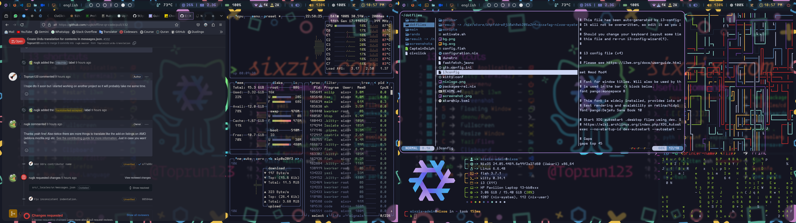

# This is a collection of my nixos dotfiles.

#### Quickstart
- You can reproduce this nixos build by just editing the `configuration.nix` file to use your username instead of `sixzix-admin` 
- And then make sure you go through all the code before running `activate.sh` to automatically link nixos to use this configuratin.
- Make sure it exists in you user home directory as `~/` is used a lot throughout all the files.
- You might still have to setup some `xfce` settings and make sure xfce power manager is not running/enabled.

#### i3 KeyBinds / other dmenu etc features.
TODO
